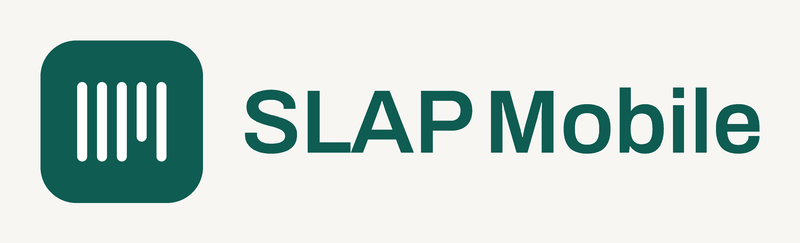

  

  Inventário patrimonial sem internet e sem servidor: cada celular carrega o inventário
  inteiro, funciona sozinho e sincroniza com os outros pela rede Wi-Fi local.

  
  &nbsp;
  
  &nbsp;
  
  &nbsp;
  

## O que é

Substitui o SLAP, o sistema web de inventário do Instituto Federal do Piauí, que sem rede não
funciona. Aqui o celular é o inventário: importa a planilha do SUAP, lê os códigos de barras com
retorno sonoro para cada resultado e separa os patrimônios em três grupos, prontos para o SUAP.
Os aparelhos da mesma rede trocam o que cada um levantou, direto entre eles.

## Capturas

  
  &nbsp;
  
  &nbsp;
  
  &nbsp;
  

## Instalar

Baixe o APK `arm64-v8a` da [versão mais recente](https://github.com/guilhermefeitosa66/slap-mobile/releases/latest),
autorize a instalação de fonte desconhecida e instale. Precisa de Android 7.0 ou mais novo. Para
atualizar, instale por cima; **não desinstale**, porque desinstalar apaga o que ainda não foi
sincronizado. Passo a passo em [docs/instalacao.md](docs/instalacao.md).

## Como usar

1. Informe seu nome e matrícula. Ficam no aparelho e acompanham cada verificação.
2. Toque em **Novo**, importe a planilha exportada do SUAP e confira as colunas.
3. Chame os colegas por **Compartilhar**: QR code ou link. Eles entram por **Novo → Ler o QR code**, na mesma rede Wi-Fi.
4. Diga em que sala está e quem é o responsável; a configuração vale para as próximas leituras.
5. Leia os códigos pela câmera, por um leitor externo ou digitando o tombo. Verde, laranja e vermelho têm som e vibração próprios.
6. Sincronize quando quiser. Conflitos aparecem para alguém decidir.
7. Exporte os três grupos em XLSX ou CSV.

A versão ilustrada está no [site do projeto](https://guilhermefeitosa66.github.io/slap-mobile/#como-usar).

## Desenvolvimento

`make` lista as tarefas:

| Tarefa | O que faz |
|---|---|
| `make dependencias` | instala os pacotes (`flutter pub get`) |
| `make verificar` | confere Flutter, Android SDK, Java, pacotes e aparelhos conectados |
| `make rodar` | roda em modo de desenvolvimento, com hot reload |
| `make apk` | gera o APK de uso |
| `make instalar` | gera o APK e instala por cima no aparelho, mantendo os dados |
| `make site` | gera o site do GitHub Pages em `_site` |
| `make testar` | formatação, análise e testes, como no CI |
| `make limpar` | apaga o que os builds geraram |

Arquitetura, decisões e o resto do processo estão em [docs/](docs/): comece por
[docs/desenvolvimento.md](docs/desenvolvimento.md).

## Licença

[Apache-2.0](LICENSE).
