# Manual do SLAP Mobile

Este manual é para quem vai conduzir o inventário patrimonial: a comissão, o setor de
patrimônio e quem estiver com o celular na mão percorrendo as salas. Ele cobre o aplicativo
inteiro, na ordem em que as coisas acontecem — da planilha exportada do SUAP até os arquivos
que alimentam o relatório final.

Não é preciso ler tudo de uma vez. O índice leva direto ao ponto, e cada seção se explica
sozinha.

## Antes de começar

O inventário patrimonial é a conferência, item por item, do que o SUAP diz que existe.
Alguém vai até cada bem, lê a etiqueta de tombo colada nele e registra onde ele está, de
quem é, em que estado está e se está em uso. No fim, três listas: o que confere, o que
precisa de correção no SUAP e o que não foi encontrado.

O SLAP Mobile faz esse trabalho sem internet e sem servidor. Cada celular carrega o
inventário inteiro e funciona sozinho; quando dois aparelhos se encontram na mesma rede
Wi-Fi, eles trocam o que cada um levantou.

**O que você precisa ter:**

- **A planilha exportada do SUAP**, em XLSX ou CSV. É ela que diz quais bens existem, com
  tombo, descrição, sala e responsável.
- **Um ou mais celulares Android**, versão 7.0 ou mais nova, com o aplicativo instalado.
  A instalação está em [instalacao.md](instalacao.md) — inclusive como atualizar sem perder
  o que já foi levantado.
- **Uma rede Wi-Fi em comum**, se mais de uma pessoa vai levantar. Só é necessária na hora
  de entrar no inventário e na hora de trocar dados; o levantamento em si não usa rede.
- **Um leitor de código de barras** é opcional. O aplicativo lê pela câmera do celular e
  também aceita o tombo digitado.

**Quem participa.** Uma pessoa importa a planilha e cria o inventário. As outras entram por
um QR code ou por um link, e a partir daí cada aparelho tem a cópia inteira. Não existe
aparelho principal: qualquer um pode ficar sem bateria, sair da rede ou ser trocado sem
interromper os demais — desde que o que ele levantou já tenha sido trocado com alguém.

## Identidade: quem está levantando

Na primeira abertura, o aplicativo pede **nome** e **matrícula**. Não há senha, conta nem
cadastro: os dois campos ficam gravados no próprio aparelho.

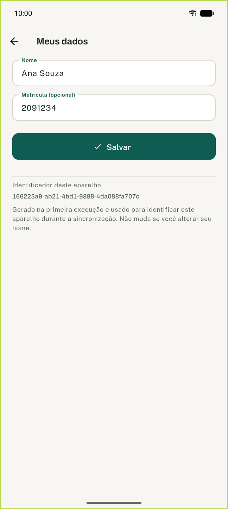

Eles servem a uma coisa só: dizer quem conferiu cada bem. Toda verificação registrada neste
aparelho leva o seu nome, e ele aparece no detalhe do patrimônio ("Verificado por Ana Souza
(2091234)") e nos relatórios exportados. Numa comissão com quatro pessoas, é o que permite
voltar e perguntar a quem leu determinado item.

A matrícula é opcional, mas vale preencher: nomes se repetem, matrículas não.

**Para trocar depois:** **Ajustes → Você → seu nome**. A mudança vale das próximas leituras
em diante; o que já foi registrado continua com o nome de quem registrou, que é o correto.

> **Identidade do aparelho é outra coisa.** Além do seu nome, cada celular tem um
> identificador próprio, que o aplicativo usa para manter os dados coerentes entre os
> aparelhos. Ele não é mostrado em lugar nenhum além dos Ajustes, e só precisa ser trocado
> num caso específico, descrito em [Perguntas e problemas comuns](#dois-aparelhos-estão-com-a-mesma-identidade).

## Criar o inventário

A lista de inventários é a primeira tela. Na primeira abertura, sem nenhum inventário, ela
oferece dois caminhos no centro da tela; depois do primeiro, os mesmos dois passam a ficar no
botão **Novo**, no canto inferior:

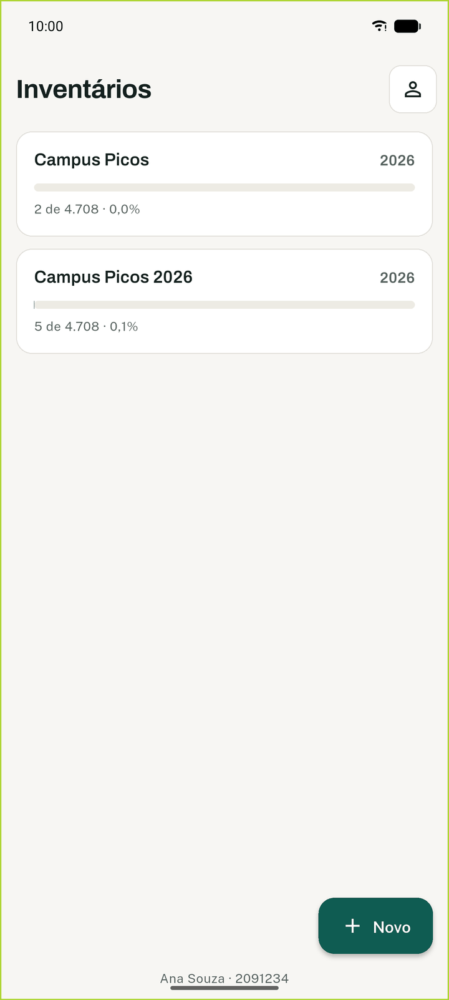

- **Importar de arquivo** — para quem vai começar o inventário. Cria o inventário com nome e
  ano e importa a planilha do SUAP.
- **Ler o QR code de outro aparelho** — para quem vai participar de um inventário que outra
  pessoa já criou. Recebe uma cópia pela rede local.

Puxando a lista de cima para baixo, ela é relida — e o aplicativo aproveita para conferir se há
versão nova.

Um aparelho pode ter vários inventários ao mesmo tempo — o do campus deste ano, o do ano
passado, o de uma unidade específica. Cada um é independente.

**Nome e ano.** O nome aparece em toda parte e vai no cabeçalho dos relatórios; use o que a
comissão vai reconhecer, como "Campus Picos" ou "Campus Picos — Biblioteca". O ano separa
inventários do mesmo lugar em exercícios diferentes.

## Importar a planilha

A importação tem três passos, e o segundo é o que evita o erro caro.

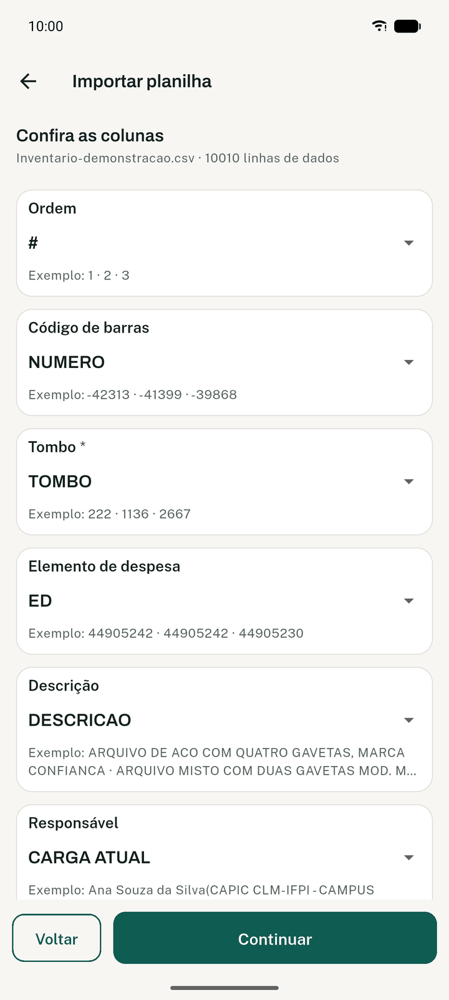

### 1. Escolher o arquivo

Servem as duas origens, sem você precisar dizer de qual veio:

- a exportação do **SUAP**;
- a do **inventario.ifpi.edu.br**.

Os nomes das colunas são diferentes nas duas, e o aplicativo reconhece ambos. Aceita **XLSX** e
**CSV**. Planilhas `.xls` antigas precisam ser abertas e salvas como `.xlsx` antes — o aplicativo
avisa e não tenta adivinhar.

Enquanto o arquivo é lido, uma barra mostra quantas linhas já foram percorridas. Com a
planilha de um campus inteiro — dez mil linhas — isso leva alguns segundos.

### 2. Conferir as colunas

As colunas são reconhecidas **pelo nome**, então a ordem na planilha não importa. Esta tela
mostra o que foi reconhecido e, embaixo de cada campo, três valores de exemplo tirados da
própria planilha.

**Confira os exemplos, não só os nomes.** Um cabeçalho pode enganar; o conteúdo não. Se a
coluna "Tombo" mostrar descrições de móveis, o reconhecimento errou.

Para corrigir, toque no campo e escolha outra coluna. Campos que a sua planilha não tem
ficam em "Não importar".

| Campo | Para que serve |
|---|---|
| **Tombo** | Obrigatório. É o número que identifica o bem. |
| **Código de barras** | O que o leitor lê. Pode ser diferente do tombo — no `inventario.ifpi.edu.br` ele está na coluna `Número`. |
| **Descrição** | O que aparece na lista a cada leitura. |
| **Sala** | Onde o cadastro diz que o bem está. Vira o valor "da planilha". Não confundir com `Setor`, que é a unidade administrativa. |
| **Responsável** | De quem o cadastro diz que o bem é. |
| **Elemento de despesa (ED)** | Usado no passo 3 para deixar grupos de fora. É o código (`44905242`), não o nome do grupo. |
| **Valor** | Informativo, sai nos relatórios. |

A tela também diz quantas linhas de dados o arquivo tem, o que é uma conferência barata: se
a planilha do campus tem dez mil itens e a tela diz doze, alguma coisa está errada no
arquivo.

### 3. Escolher o que fica de fora

O último passo lista os **elementos de despesa** encontrados, com a contagem de cada um.
Desmarque os que não entram no inventário — material bibliográfico é o caso típico: a
biblioteca tem dezenas de milhares de volumes que não são conferidos um a um.

Os itens desmarcados continuam no aparelho e podem ser lidos, mas ficam fora do progresso e
dos relatórios. Sem isso, o inventário nunca chegaria a 100%.

No pé da tela, "N entrarão no inventário" é o número final. Toque em **Importar**.

### Importar de novo, por cima

Reimportar a planilha no mesmo inventário — para corrigir uma coluna que entrou errada, ou
porque o SUAP recebeu bens novos — **acrescenta, e nunca apaga**. Os itens que já existem são
preservados com todo o levantamento feito neles; só os que faltavam entram. Ao fim, o
aplicativo diz quantos entraram e quantos já existiam.

É seguro reimportar no meio do inventário, com dias de trabalho já feitos.

## Compartilhar e entrar

Quem criou o inventário compartilha; os demais entram. Os dois aparelhos precisam estar na
mesma rede Wi-Fi, e o aplicativo de quem compartilha precisa ficar aberto até o outro entrar.

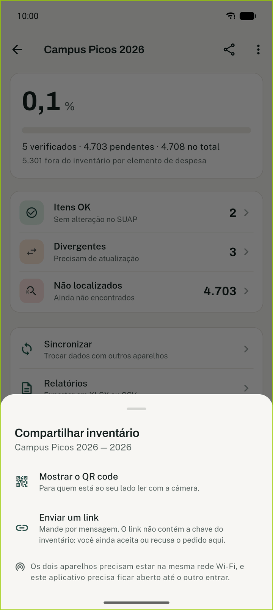

No painel do inventário, toque no ícone de compartilhar. Há duas opções:

- **Mostrar o QR code** — para quem está ao seu lado. A outra pessoa aponta a câmera.
- **Enviar um link** — para quem está longe. Vai pela folha de compartilhamento do celular
  (mensagem, e-mail, grupo). O link **não** contém a chave do inventário.

> O QR code contém a chave de acesso ao inventário. Mostre apenas a quem vai participar.

**No aparelho que vai entrar:** **Novo → Ler o QR code de outro aparelho**, e aponte para o
código na tela do outro celular. O link também pode ser lido pela câmera, se quem convidou
mostrar o link na tela.

### O pedido de entrada

Ler o código não basta para entrar. O aparelho que vai entrar procura na rede quem tem aquele
inventário e **pede entrada**; no aparelho de quem compartilhou aparece um aviso:

> **Pedido de entrada** — Ana Souza quer entrar em Campus Picos 2026.
> **Recusar** · **Aceitar**

Só depois do **Aceitar** a chave é entregue e a cópia começa a baixar. O pedido vale um
minuto; passado esse tempo, quem pediu tenta de novo.

Enquanto a cópia chega, a tela mostra o andamento: procurando aparelhos, baixando o
inventário (com o tamanho já recebido) e, por fim, recebendo o levantamento que já foi feito.
Num inventário de campus são alguns megabytes por Wi-Fi.

### Quando os aparelhos não se encontram

É o problema mais comum em campo, e quase sempre é um destes:

1. **Não estão na mesma rede.** Um no Wi-Fi, outro nos dados móveis, ou em redes diferentes
   do mesmo prédio.
2. **A tela de compartilhar foi fechada.** Ela precisa ficar aberta no aparelho de origem.
3. **A rede isola os aparelhos.** Muita rede institucional impede que dois celulares se
   vejam, por segurança. Não há o que fazer no aplicativo: ligue o **ponto de acesso** de um
   dos celulares e conecte os demais a ele. Funciona sem internet — o ponto de acesso serve
   só para os aparelhos se enxergarem.

## Configurar as leituras

Antes da primeira leitura, o aplicativo pergunta onde você está e o que aplicar. É a tela
mais importante do sistema: é dela que vem a velocidade do levantamento.

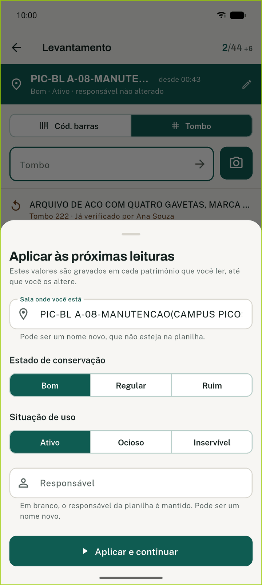

| Campo | O que fazer |
|---|---|
| **Sala onde você está** | Texto livre, com sugestões da planilha. Pode ser um nome novo, que o SUAP ainda não conhece. |
| **Estado de conservação** | Bom, Regular ou Ruim. |
| **Situação de uso** | Ativo, Ocioso ou Inservível. |
| **Responsável** | Texto livre, com sugestões. **Em branco significa "não alterar"**. |

**Estes valores são gravados em cada patrimônio que você ler, até que você os altere.** Você
configura uma vez e lê dezenas de itens sem tocar na tela.

**"Em branco" no responsável é uma decisão, não um esquecimento.** Deixando vazio, cada item
lido mantém o responsável que veio do SUAP — que é o certo quando você está conferindo a
carga de outra pessoa. Preencha apenas quando a carga realmente mudou.

**Estado de conservação e situação de uso não vêm da planilha.** Eles são levantados em
campo, e não existem antes da sua leitura. Por isso nunca aparecem como "divergência": o que
você registra é informação nova. O que exige providência — `Ruim`, `Inservível` — ganha uma
marca de atenção na lista e nos relatórios.

**Trocar a configuração:** toque na faixa verde no alto da tela de levantamento. Mudar de
sala é o motivo mais frequente, mas não é o único: o responsável, o estado e a situação mudam
sem você sair do lugar.

> **Confirmação da sala.** Se passarem horas sem nenhuma leitura — você voltou no dia
> seguinte, ou almoçou —, o aplicativo pergunta "Ainda em *sala*?" antes de gravar a leitura
> seguinte. A leitura que esbarrou na pergunta **não** é gravada: confirme ou troque a sala e
> leia de novo. É o que evita uma sala inteira registrada no lugar errado.

## Levantamento

Esta é a tela onde o trabalho acontece.

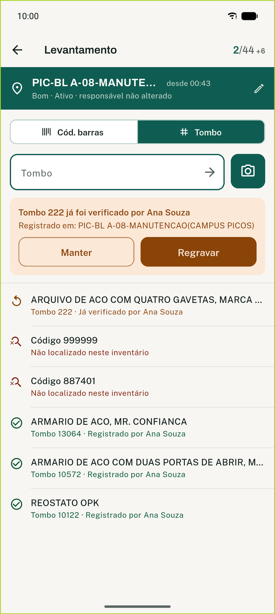

No alto, a faixa verde mostra a configuração em vigor e, à direita, o **contador da sala**:
`4/44` são as verificações feitas das 44 que a planilha aponta para esta sala. O `+6` ao lado
são itens que a planilha aponta para outra sala e que você encontrou aqui — eles não entram
no denominador, porque ninguém os procuraria neste ambiente.

### As três formas de ler

- **Leitor externo** — o leitor se comporta como um teclado. O campo já está com o foco, e
  ele volta sozinho depois de cada leitura: dá para ler um item atrás do outro sem tocar na
  tela.
- **Câmera** — o botão à direita do campo abre a câmera, que lê um código atrás do outro sem
  fechar entre um e outro.
- **Digitando** — o tombo ou o código, e Enter.

O seletor acima do campo escolhe o que o número significa: **Cód. barras** ou **Tombo**. Se
não achar no campo escolhido, o aplicativo tenta o outro antes de desistir — ler no modo
errado não custa nada.

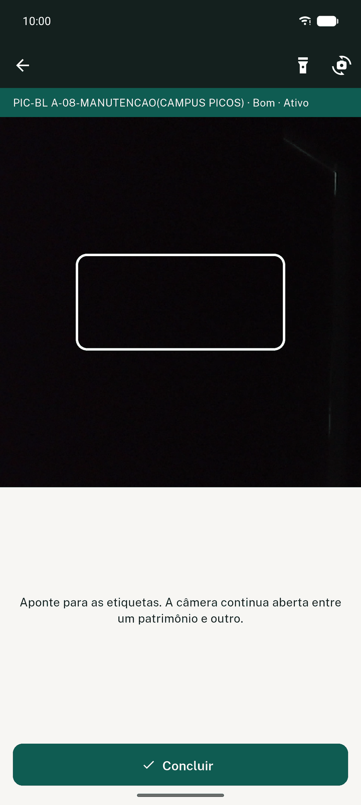

### Os três retornos

Cada leitura responde com **som, vibração, cor e texto próprios**. O som é o que permite
trabalhar sem olhar a tela, com a atenção na etiqueta e no bem.

| Resultado | O que significa | O que fazer |
|---|---|---|
| **Registrado** (verde) | Encontrado na planilha e gravado com a configuração atual. | Nada. Siga para o próximo. |
| **Já verificado** (laranja) | Este item já foi lido — por você ou por um colega. | Decidir, veja abaixo. |
| **Não localizado** (vermelho) | O código lido não está na planilha deste inventário. | Veja abaixo. |

**"Já verificado" nunca é sobrescrito em silêncio.** O aplicativo mostra quem verificou, onde
registrou, e oferece duas saídas:

- **Manter** — o registro anterior continua valendo. É o caso da releitura acidental, que é
  comum.
- **Regravar** — grava de novo, com a configuração atual. Use quando o registro anterior está
  errado: o item foi lido na sala errada, ou o estado mudou.

**"Não localizado" é diferente aqui e no painel.** Numa leitura, significa que aquele código
não está na planilha deste inventário — pode ser um bem de outra unidade, um patrimônio que o
SUAP ainda não tem, ou um código lido errado. No painel do inventário, "Não localizados" é
outra coisa: os itens da planilha que ainda não foram encontrados.

Diante de um "não localizado" numa leitura, confira se o número na etiqueta é o que apareceu
na tela, e tente o outro modo (tombo em vez de código de barras). Persistindo, anote o item
em papel: ele não está na planilha, e isso é informação para o setor de patrimônio.

### A tela fica ligada

Durante o levantamento e com a câmera aberta, a tela não apaga sozinha. Nas demais telas o
bloqueio segue o normal do celular. Isso se desliga em **Ajustes → Manter a tela ligada**.

## Todos os itens

O painel do inventário mostra o progresso e os três grupos; tocar num grupo abre a lista
filtrada por ele. **Todos os itens** abre a lista inteira.

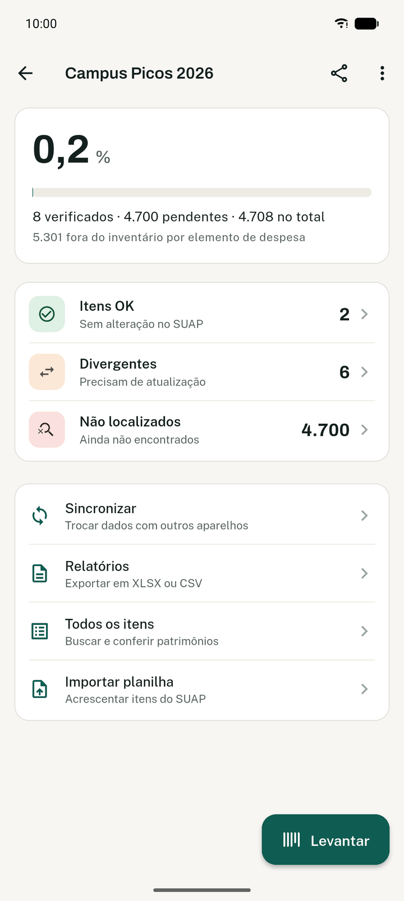

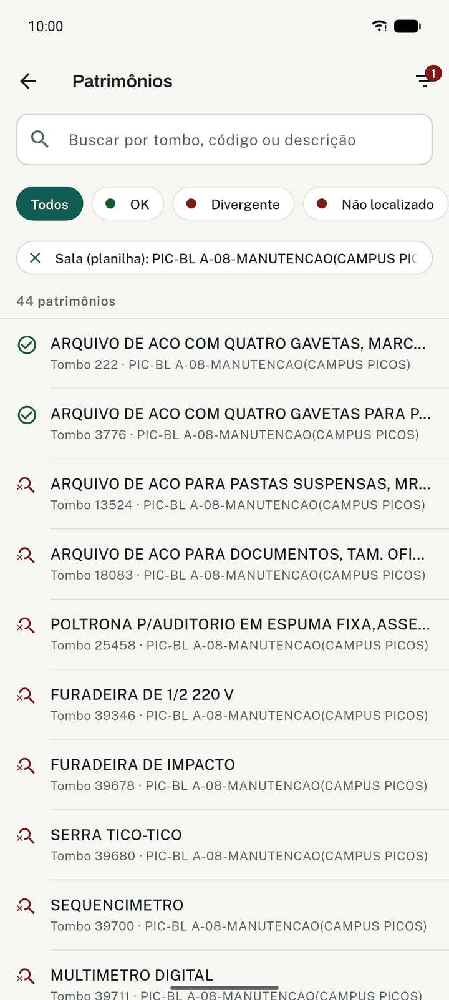

**Busca** por tombo, código de barras ou descrição. Zeros à esquerda e sinal de menos não
atrapalham: `19281`, `019281` e `-19281` encontram o mesmo bem.

**Filtros** — combinam entre si, com a busca e com o grupo que está aberto:

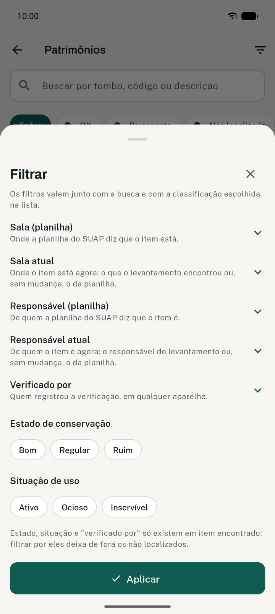

| Filtro | O que ele pergunta |
|---|---|
| Sala (planilha) | Onde o SUAP diz que o item está. |
| Sala atual | Onde o levantamento encontrou o item. |
| Responsável (planilha) | De quem o SUAP diz que o item é. |
| Responsável atual | De quem o item é depois do levantamento. |
| Estado de conservação | Só existe em item verificado. |
| Situação de uso | Só existe em item verificado. |
| Verificado por | Quem registrou, em qualquer aparelho. |

Os três últimos só existem em item encontrado: filtrar por eles é, na prática, pedir só os
itens verificados.

### O detalhe de um patrimônio

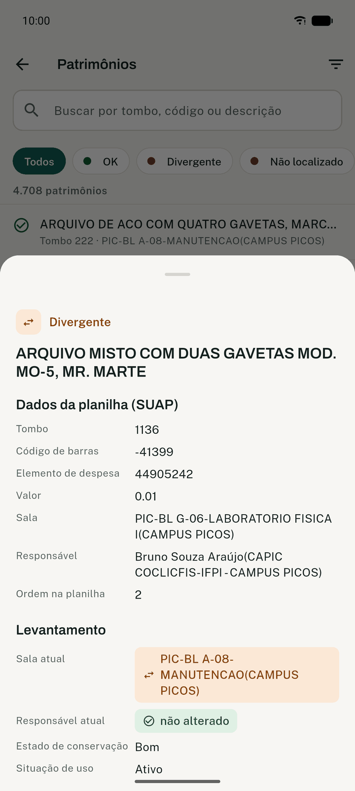

A tela é dividida em duas partes, e a divisão é proposital:

- **Dados da planilha (SUAP)** — tombo, código de barras, elemento de despesa, descrição,
  sala, responsável, valor. **Nunca mudam.** É o que o cadastro dizia quando a planilha foi
  exportada, e é com isso que o levantamento é comparado.
- **Levantamento** — sala atual, responsável atual, estado de conservação, situação de uso,
  além de quem verificou, quando, e se foi neste aparelho ou em outro.

**Corrigir o levantamento de um item.** O botão no pé da tela abre o formulário:

- Em item já verificado, **Editar levantamento** muda o que foi registrado.
- Em item ainda não encontrado, **Verificar manualmente** registra a verificação sem leitura
  — para o bem cuja etiqueta se soltou ou está ilegível.

## Trocar dados entre os aparelhos

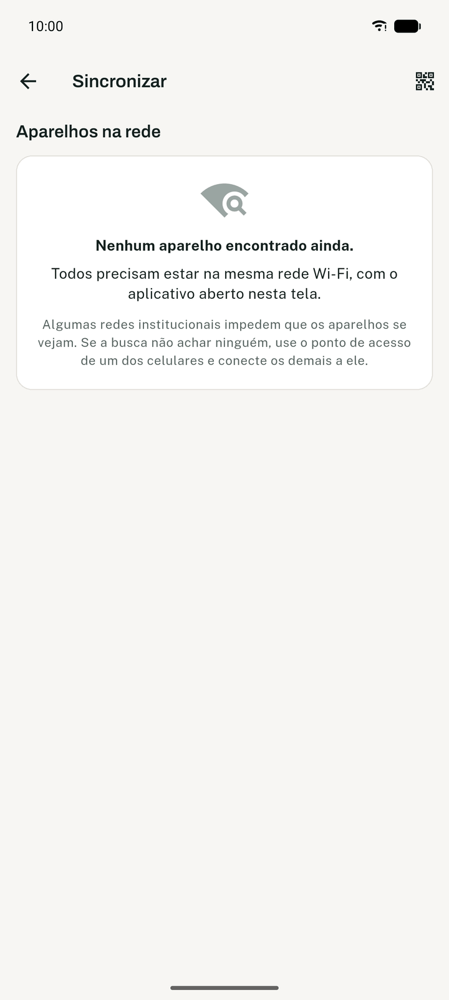

**A troca é nos dois sentidos.** Numa só ação, o aparelho manda o que você levantou e recebe
o que o outro levantou. Nada é apagado, e não há risco de sobrescrever o trabalho de ninguém.

Os aparelhos da mesma rede se encontram sozinhos e aparecem na lista, com o nome de quem está
usando cada um. Toque num aparelho para trocar com ele, ou em **Trocar com todos** para
percorrer a lista inteira — nesse caso a tela diz em qual aparelho está ("aparelho 2 de 3").

Durante a troca, uma barra mostra o que está sendo recebido e o que está sendo enviado. Ao
fim aparece um aviso com o resultado — quantos itens foram atualizados com o que chegou,
quantas alterações suas foram para o outro aparelho, e quantos conflitos ficaram para
conferir — que você fecha em **OK**. Com pouca coisa a trocar isso leva um instante, e o
aviso é o que confirma que deu certo.

Depois, cada aparelho na lista mostra o resultado da última troca e o horário dela.

**Com que frequência trocar?** Sempre que houver oportunidade — no fim de cada bloco de
salas, na hora do café, ao fim do dia. Enquanto o que você levantou está só no seu aparelho,
ele se perde se o celular se perder. Depois da troca, está em dois lugares.

### Conflitos

Duas pessoas podem alterar o mesmo item sem que nenhuma soubesse da outra — cada uma no seu
aparelho, antes de trocarem dados. Isso é um **conflito**, e o aplicativo não decide sozinho
qual valor é o certo.

Substituir um valor que você já conhecia não é conflito: é uma correção normal, e não gera
aviso nenhum. O conflito é só o caso de duas escritas que se ignoraram.

Quando há conflito, um aviso aparece no painel e na tela de troca de dados. Abrindo-o, você
vê os valores em disputa, quem registrou cada um e quando, com um deles marcado como
**Valendo** — o aplicativo não deixa o dado indefinido enquanto ninguém decide. Toque em
**Usar este** no valor correto, ou em **Manter** para confirmar o que já está valendo.

A decisão vale para todos os aparelhos na troca seguinte, e o conflito não volta a aparecer.

### Relógios fora de sincronia

Se o relógio de um dos celulares estiver muito errado, a troca é recusada e nada é
transferido. A tela mostra as duas horas lado a lado e o que fazer: ativar a data e a hora
automáticas nos dois aparelhos, em **Configurações → Sistema → Data e hora**, e trocar de
novo.

A recusa é proposital. A ordem das alterações depende do horário em que foram feitas; aceitar
dados de um aparelho com a data errada contaminaria o inventário inteiro.

## Relatórios

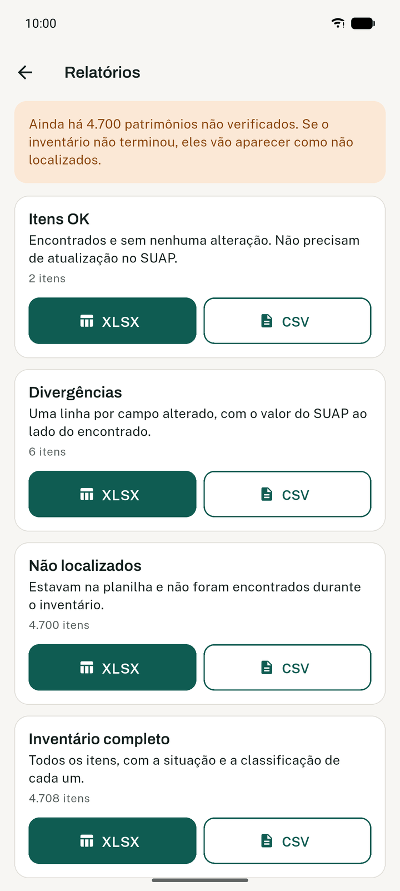

São quatro, cada um em **XLSX** ou **CSV**:

| Relatório | O que traz |
|---|---|
| **Itens OK** | Encontrados e sem nenhuma alteração. Não precisam de atualização no SUAP. |
| **Divergências** | Uma linha por campo alterado, com o valor do SUAP ao lado do encontrado. |
| **Não localizados** | Estavam na planilha e não foram encontrados durante o inventário. |
| **Inventário completo** | Todos os itens, com a situação e a classificação de cada um. |

Os três primeiros são o resultado do processo, na divisão que a comissão precisa apresentar.
O quarto é a base completa, para conferência.

**Divergência existe em dois campos: sala e responsável.** São os únicos que também vêm da
planilha e que, portanto, têm um valor anterior com que comparar. Estado de conservação e
situação de uso são levantados em campo e não têm base — quando exigem providência
(`Ruim`, `Inservível`), saem marcados como atenção no relatório completo.

**Para que servem depois.** Os arquivos alimentam o relatório final do processo de
inventário, que é documentado e arquivado, e vão ao setor de patrimônio para atualizar as
informações no SUAP — item a item, a partir da lista de divergências.

**Os relatórios saem iguais em qualquer aparelho — depois de sincronizar.** Antes da troca,
cada aparelho só conhece o que ele próprio levantou. Antes de exportar o resultado final,
troque dados com todos os aparelhos da comissão.

## Ajustes

**Ajustes** fica no canto superior direito da lista de inventários.

| Ajuste | O que faz |
|---|---|
| **Você** | Nome e matrícula que acompanham as suas verificações. |
| **Manter a tela ligada** | Durante o levantamento e com a câmera aberta. |
| **Som a cada leitura** | Um som diferente para registrado, já verificado e não localizado. |
| **Vibrar a cada leitura** | Útil em biblioteca e sala de aula, com o som desligado. |
| **Tema** | Claro, escuro ou o que o celular estiver usando. |
| **Avisar de versão nova** | Ao abrir, pergunta ao GitHub qual é a última versão publicada. Não envia nada do inventário; dá para desligar. |
| **Exportar cópia** / **Restaurar de uma cópia** | Veja abaixo. |
| **Gerar nova identidade** | Só num caso, descrito em [Perguntas e problemas comuns](#dois-aparelhos-estão-com-a-mesma-identidade). |
| **Versão do aplicativo** | Qual versão está instalada aqui. |
| **Licenças** | Bibliotecas e fontes usadas pelo aplicativo. |

## Cópia de segurança

**Exportar cópia** grava todos os inventários deste aparelho num arquivo, que você guarda
onde quiser — no próprio celular, no Drive, num pendrive. O painel de cada inventário também
oferece **Exportar cópia deste inventário**, quando você quer só um.

**Restaurar de uma cópia** traz o que a cópia tem para este aparelho **sem apagar nada**: o
que já está aqui permanece, e o que vier da cópia é acrescentado. Restaurar uma cópia antiga
não desfaz o trabalho feito depois dela.

**Quando isso importa:**

- Antes de reinstalar o aplicativo, se o Android recusar a atualização por cima.
- Quando um aparelho vai ser trocado ou devolvido.
- Ao fim de um dia de trabalho em que não foi possível trocar dados com ninguém.

A cópia **não** substitui a troca entre aparelhos: ela protege contra a perda do celular, mas
não junta o trabalho da comissão. Para isso, troque dados.

Detalhes e o formato do arquivo estão em
[copia-de-seguranca.md](copia-de-seguranca.md).

## Encerrar e reabrir o inventário

Terminado o levantamento e exportados os relatórios, **Encerrar inventário** (no menu do
painel) fecha o processo: o inventário deixa de aceitar leituras e edições, e a tela de
levantamento passa a explicar o bloqueio em vez de abrir. Os dados continuam todos lá, e os
relatórios continuam sendo exportáveis.

Encerrar é uma marca do processo, não um apagamento. Se aparecer um bem esquecido numa sala,
**Reabrir inventário** volta tudo ao normal.

O encerramento se propaga na troca de dados: encerrado num aparelho, encerra nos demais.

**Apagar deste aparelho** é outra coisa, e é definitivo neste celular. Antes de apagar, o
aplicativo diz exatamente o que se perde — quantas verificações feitas aqui ainda não
chegaram a nenhum outro aparelho. Se o aviso disser que nada se perde, o trabalho já está em
outro lugar e pode voltar por uma troca de dados.

## Perguntas e problemas comuns

### O aplicativo não instala

O caminho completo, com os avisos que o Android mostra e o que responder a cada um, está em
[instalacao.md](instalacao.md). O ponto mais frequente: é preciso autorizar a instalação a partir
do aplicativo que abriu o arquivo — o navegador, normalmente. O APK é um só, e serve a qualquer
celular Android.

### Os aparelhos não se encontram

Confira, nesta ordem: os dois estão no mesmo Wi-Fi; o aplicativo está aberto na tela de troca
de dados nos dois; e a rede não isola os aparelhos entre si. O terceiro caso é comum em rede
institucional e não tem solução no aplicativo — use o ponto de acesso de um dos celulares e
conecte os demais a ele.

### O código lido não é encontrado

- **Confira o modo.** O seletor acima do campo alterna entre código de barras e tombo. O
  aplicativo tenta os dois, mas vale conferir qual número está na etiqueta.
- **Confira se o item é deste inventário.** Bens de outra unidade não estão na planilha.
- **Elemento de despesa excluído.** O item é lido normalmente, e o aplicativo avisa que ele
  está fora do inventário.
- **Etiqueta ilegível.** Procure o bem pela descrição em **Todos os itens** e use
  **Verificar manualmente** no detalhe.

### Duas pessoas leram o mesmo item

Não é problema: o primeiro registro é preservado, e quem ler depois recebe "já verificado"
com a opção de manter ou regravar. Se as duas alterarem o mesmo campo sem terem trocado dados
antes, aparece um **conflito** para alguém decidir — veja [Conflitos](#conflitos).

### O relógio de um aparelho está errado

A troca com aquele aparelho é recusada até que a data e a hora sejam corrigidas, e nada é
transferido. Ative a data e a hora automáticas nos dois celulares e troque de novo. Nenhum
dado se perde enquanto isso: o que foi levantado continua no aparelho.

### Dois aparelhos estão com a mesma identidade

Acontece quando a cópia de segurança de um celular é restaurada em outro e os dois passam a
levantar ao mesmo tempo. A troca de dados detecta e recusa, dizendo qual aparelho está
duplicado.

No aparelho que está duplicando — **e só nele** —, use **Ajustes → Gerar nova identidade**.
Leia o aviso com atenção: o aparelho passa a ser um novo participante e precisa entrar nos
inventários de novo, pelo QR code. Antes disso, troque dados com um colega, para não perder o
que foi levantado.

### O item lido demora a aparecer na lista

Não deve mais acontecer. Se acontecer, o levantamento não está perdido: o contador da sala,
no alto da tela, sobe no momento da gravação, e o item está na lista de **Todos os itens**.
Vale relatar numa [issue](https://github.com/guilhermefeitosa66/slap-mobile/issues).

### Apareceu um aviso de versão nova

O aplicativo é instalado por arquivo, fora da loja, e nada mais avisaria que saiu uma versão
corrigida. A faixa laranja aparece no alto da lista de inventários; tocando em **Baixar nova
versão**, a página de instalação abre no navegador. Instalar por cima mantém os inventários —
**não desinstale**.

**Agora não** tira a faixa enquanto o aplicativo estiver aberto. Fechando e abrindo de novo, ela
volta, até a versão ser instalada. Para não ver mais nenhum aviso, desligue em **Ajustes →
Atualizações**.

No pé da lista de inventários, abaixo do seu nome, fica a versão instalada. Quando o aplicativo
consegue conferir e está em dia, aparece "atualizado" ao lado — nada aparece quando não houve
como conferir.

Vale atualizar todos os aparelhos da comissão juntos: aparelhos em versões diferentes trocam
dados normalmente, mas um deles pode estar com um defeito que os outros já não têm.

### Não ouço o som das leituras

Confira **Ajustes → Som a cada leitura** e o volume de mídia do celular. Com o som desligado,
a vibração e a cor continuam dando o retorno. Em biblioteca e sala de aula, deixar só a
vibração costuma ser a escolha certa.

---

**Onde mais procurar.** A instalação está em [instalacao.md](instalacao.md); o que o
aplicativo guarda e para onde vão os dados, na [política de privacidade](privacidade.md); o
formato das cópias, em [copia-de-seguranca.md](copia-de-seguranca.md). Dúvidas e problemas:
[issues do projeto](https://github.com/guilhermefeitosa66/slap-mobile/issues).
